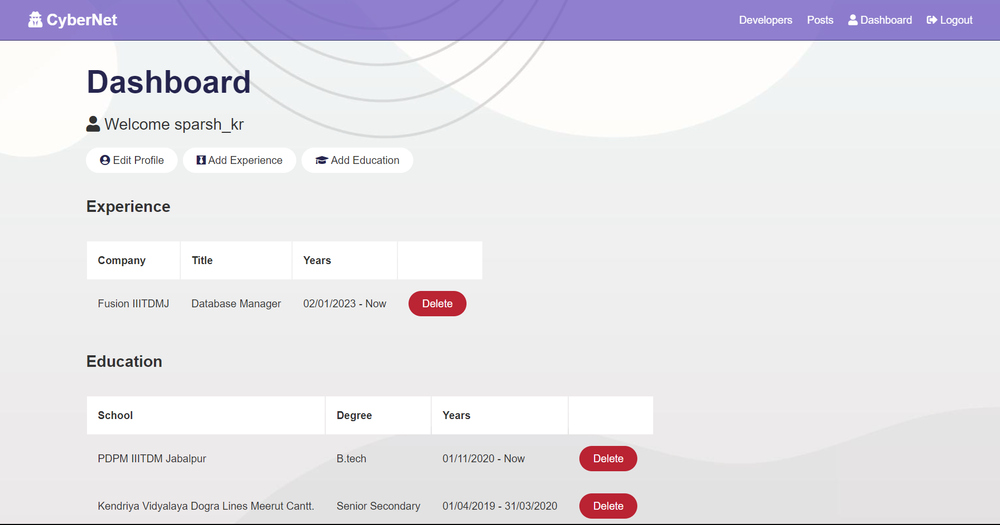
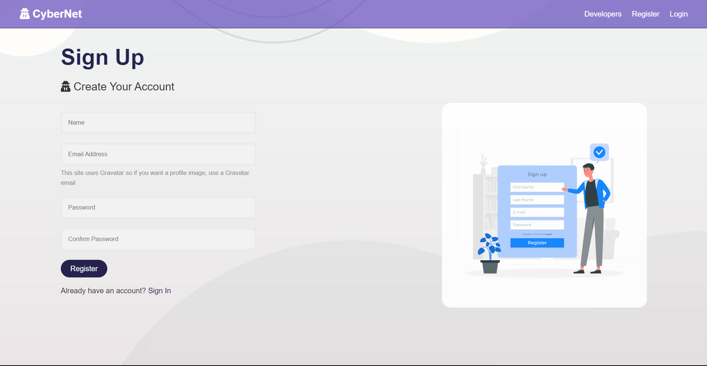

# CyberNet ‎‍💻

### Live Link:-https://cybernet.onrender.com/

- A Social network for Programmers, built on the MERN stack
- Functionalities of the app:
    - Signup or login into CyberNet
    - Add Details to your profile (Education, Experience, Social Links etc.)
    - Connect with other developers
    - Post your ideas, Like and Comment on different posts in the Dev community

***

## Screenshots:
|Screen Name | Screenshots |
|---|--|
|Landing Page||
|Dashboard||
|SignUp||
|Community||
|Post Section||
|View profile||
|Add Education||


***
## Run app on your local machine:
- Install the dependencies on Server Side as well as client side
    ```bash
    cd server/
    npm i
    node server.js
    
    cd client/
    npm i
    npm start
     ```
