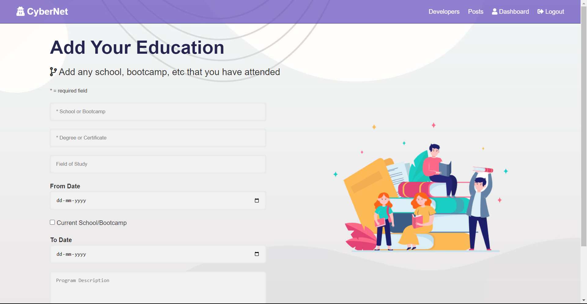

# CyberNet ‎‍💻
- A Social network for Programmers, built on the MERN stack
- Functionalities of the app:
    - Signup or login into DevLink
    - Add Details to your profile (Education, Experience, Social Links etc.)
    - Add your Github username to display your top five repositories
    - Connect with other developers and post your updates, Like and Comment on different posts in the Dev community

***

## Screenshots:
|Screen Name | Screenshots |
|---|--|
|Landing Page||
|Dashboard||
|SignUp||
|Community||
|Post Section||
|View profile||
|Add Education||


***
## Run app on your local machine:
- Install the dependencies on Server Side as well as client side
    ```bash
    npm i
    cd client/
    npm i
    cd ..
     ```
- Run the project in your local machine
    ```bash
    npm run dev
    ```
